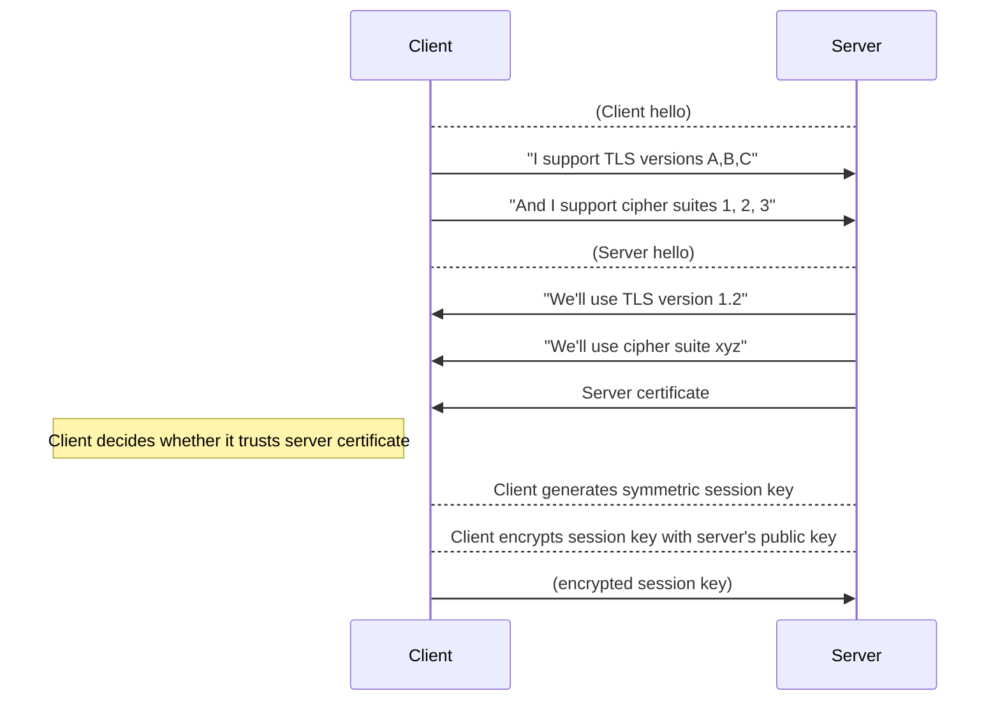

# Day 2: Fundamentals of cryptography

---

@ul

- Alice, Bob, and Eve
- Basics of encryption algorithms, key exchange, and cryptosystems
- Keeping track of what's secret, and from whom
- Encryption vs. hashing, strong vs. weak, fast vs. slow
- What does it take to attack encryption?

@ulend

---

#### Intro: Alice, Bob, Eve

---

(TK A,B,E slides)

---

#### Symmetric encryption

@ul

- Example: Alice password-protects a file and emails it to Bob
    - She has to transfer the password "out of band" (over the phone, text message etc.)
-  Not a feasible way to establish trusted sessions with arbitrary partners over the internet

@ulend

---

#### Asymmetric encryption

@ul

- Much harder than symmetric encryption, but critical for communication
- Also called **public key cryptography** 
- Each party has a *keypair* consisting of a *private key* and *public key*
- Plaintext is encrypted using the other party's public key
- Anything encrypted with a given public key can only be decrypted with the corresponding private key

@ulend

---

#### Public and private keys


#### Example: TLS workflow for HTTPS connection



A nice explainer is https://robertheaton.com/2014/03/27/how-does-https-actually-work/

---

#### Server-side and client-side encryption

A central consideration of any cryptosystem is: who has the decryption keys?

---

#### Hashing

**Hash function**: A function that takes variable-length input (the *message*) and returns fixed-length output (the hash or *digest*). 

```bash
$ echo '1' | md5
b026324c6904b2a9cb4b88d6d61c81d1
$ echo 'Hello world' | md5
f0ef7081e1539ac00ef5b761b4fb01b3
$ curl -s http://www.textfiles.com/etext/FICTION/mobydick | md5
3123669b027112a39dc9848b3801b516
```

---

#### Cryptographic hashing

Hash functions that are useful for cryptography have certain properties:

- Deterministic: the same input always produces the same hash value
- Infeasible to reverse: it should not be possible to find a message that returns a given hash value
- Infeasible to find *hash collisions*, two messages that have the same hash
- Similar input messages should produce uncorrelated hash values

---

#### Uses for hashing

Hashes are how passwords are 

#### Encryption vs. hashing

Encryption is *information-preserving* and *reversible*

Hashing is *information-destroying* and (in principle) *irreversible*