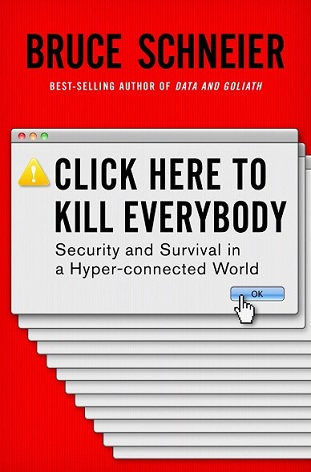

## Infosec for Data Analysts

### Introduction and Scoping

---

---

#### Day 1: Problem statement and conceptual framework

@ul

- Recent years in data security fails
- Threat models and security models
- A typology of threats
- Mindsets and organizational culture
- What are data analysts responsible for?

@ulend

---

#### Day 2: Fundamentals of cryptography

@ul

- Alice, Bob, and Eve
- Basics of encryption algorithms, key exchange, and cryptosystems
- Keeping track of what's secret, and from whom
- Encryption vs. hashing, strong vs. weak, fast vs. slow
- What does it take to attack encryption?

@ulend

---

#### Day 3: End-user security for analysts

@ul

- A baseline threat model for everybody: Hacking is programmatic
- How credentials actually get hacked: Data dumps, credential stuffing, phishing
- Stop putting it off: make your life easier with a password management makeover
- The passwordless future, supposedly
- Why all this counts double for data professionals

@ulend

---

#### Day 4: Secret management for analysts

@ul

- How to use key authentication without leaking your private key
- Keeping API tokens and other secrets out of your code and off GitHub
- Pros and cons of various places to keep secrets in deployable code

@ulend

---

#### Day 5: Software supply chain attacks

@ul

- How third-party hacks become your problem
- All the iffy stuff that happens when you `pip install`
- Ad blocking is mandatory for security
- Mitigating risk by separating roles, lowering trust, and running less software
- Heuristics for assessing third-party trustworthiness

@ulend

---

#### Day TBD: Organizational culture and human decision-making

@ul

- Security failures are management failures
- Some common organizational safeguards
- Signs of good and bad organizational health
    
@ulend

---

#### Day TBD: Regulatory compliance vs. security

@ul

- How regulatory frameworks for data security generally work
- What HIPAA-HITECH does and doesn't do
- How is GDPR changing things, and where?
- Disclosing breaches and other compromises

@ulend

---

#### Threat models and risk assessment

A threat model is a way of systematizing your security thinking. It starts with a risk assessment:

@ul

- What do you need to protect?
- Who do you need to protect it from?
- How likely is it that you'll need to protect it?
- How bad are the consequences if you fail?
- How much trouble are you willing to go to to avoid those consequences?

@ulend

---

#### Threat models and risk assessment

An additional question that will keep coming back is:

@ul

- Who do you trust?

@ulend

---

#### Threat models and risk assessment

Once you have an explicit risk assessment, you can weigh the relative importance
of the various risks you face and figure out a mitigation strategy or *security model*

---

#### Threat typology

There are many more than these, but I propose we focus on

@ul

- Credential-based attacks
    - phishing
    - credential stuffing
    - exposed secrets
    - social engineering
    
@ulend

---

#### Threat typology

There are many more than these, but I propose we focus on

@ul

- Design failures
    - open-by-default
    - open-by-design
    - security through obscurity

@ulend

---

#### Threat typology

There are many more than these, but I propose we focus on

@ul

- Software supply chain attacks
    - code repository compromise (pip, npm, CRAN, GitHub)
    - upstream patching
    - watering hole attacks

@ulend

---

#### Your mindset and attitude

@ul

- Infosec professionals are more worried than everyone else, BUT
- Security is not hopeless
- Most data breaches are caused by easily fixable problems
- It's your job too now

@ulend
